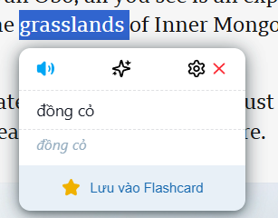

# Quizzet Translate Extension

Quizzet Translate Extension này cho phép người dùng dịch văn bản đã chọn trên trang web bằng API Google Translate. Nó hiển thị một biểu tượng bên dưới từ đã chọn, và khi nhấp vào biểu tượng, bản dịch sẽ được hiển thị cùng với tùy chọn lưu bản dịch vào mục đánh dấu.

## Tính Năng

-   Phát hiện văn bản được chọn trên trang web.
-   Hiển thị biểu tượng dịch thuật bên dưới từ đã chọn.
-   Dịch văn bản đã chọn bằng API Google Translate.
-   Khi bấm vào nút lưu vào flashcard thì sẽ tự động lưu vào từ điển lên trang quizzet.site

## Cài đặt

1. Clone hoặc tải về repository này.
   
2. Mở Chrome và điều hướng đến `chrome://extensions/` hoặc [Click vào đây](chrome://extensions/)
   

3. Bật "Chế độ nhà phát triển" bằng cách bật công tắc ở góc trên bên phải.
   
4. Nhấp vào "Tải tiện ích đã giải nén" và chọn thư mục nơi bạn đã tải về hoặc clone repository này.
   

## Cách Sử Dụng

1. Chọn bất kỳ văn bản nào trên trang web.
2. Nhấp vào biểu tượng dịch thuật xuất hiện bên dưới văn bản đã chọn.
3. Xem bản dịch trong popup và lưu vào mục đánh dấu nếu muốn.

## Giao diện

## Giấy phép

Dự án này được cấp phép theo Giấy phép MIT. Xem tệp [LICENSE](LICENSE) để biết chi tiết.

## Ghi công

-   Phát triển bởi Nguyen Trong An (trongandev) © 2025
-   Sử dụng Google Translate API để dịch

## Đóng góp

Bạn có thể tự do phát triển dựa trên dự án này, nhưng vui lòng ghi nhận tác giả gốc. Sự tôn trọng của bạn dành cho tác phẩm gốc được trân trọng. Vui lòng mở một issue hoặc gửi một pull request trên GitHub.

## Liên hệ

Nếu có bất kỳ câu hỏi hoặc phản hồi nào, vui lòng liên hệ với tôi tại trongandev@gmail.com.
